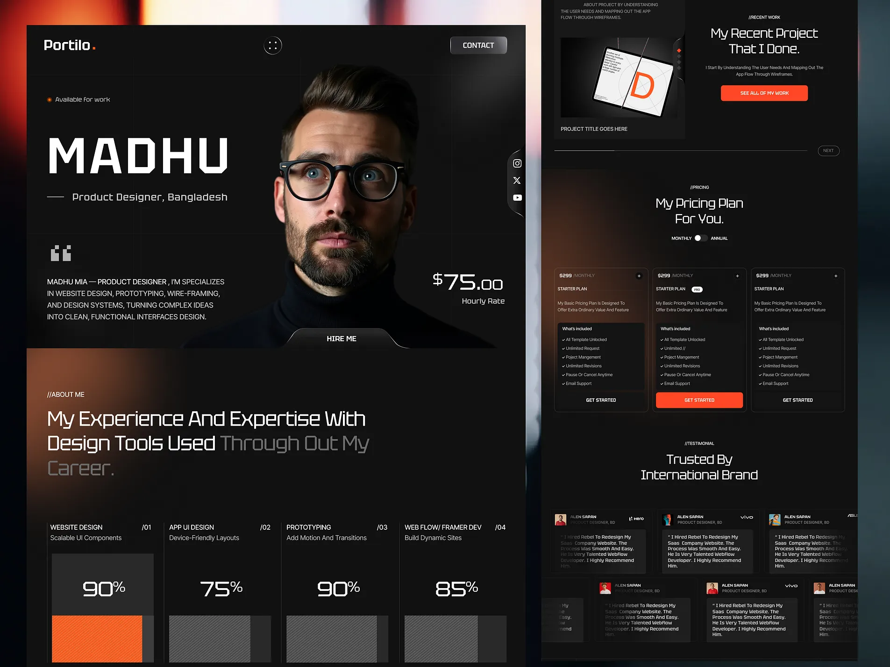

# 🚀 Daily Challenge 4 - Sheryians Coding School  
https://dribbble.com/shots/26552564-Personal-Portfolio-Website-Design  

A sleek and responsive **Personal Portfolio Website** inspired by a Dribbble concept.  
It highlights professional details, creative sections, and a futuristic dark-themed design built using **HTML & CSS** only.  

---

## ✨ Features  

| 🌟 Feature | 💡 Description |
|:-----------|:----------------|
| 🖤 Modern Dark Theme | Elegant black interface with orange gradients and minimal neon glow highlights |
| 🧑‍💻 Hero Section | Clean introduction with profile image, name, and a “Hire Me” button |
| 🧠 Skills Section | Animated progress bars showing design and development expertise |
| 🧩 What I Do | Structured list of services with supporting visuals and descriptions |
| 💼 Project Showcase | Interactive preview of a recent project with CTA to view more |
| 💵 Pricing Plans | Stylish pricing cards with toggle switch for monthly/annual plans |
| 💬 Testimonials | Glassmorphism-inspired testimonial cards from international clients |
| 💫 Scrolling Banner | Continuous “GET STARTED ✦” animation adding motion and liveliness |
| 📊 Stats Counter | Displays key achievements such as clients, experience, and success rate |
| 📱 Responsive Layout | Designed to look great across all screen sizes and devices |

---

## 🖼️ Preview  

### 🔹 Original Design Reference  
This is the **Dribbble design inspiration** for this project.  
  

### 🔹 Final Output  
Here’s the **final version I built** using HTML & CSS.  
It features a **dark minimal layout**, elegant animations, and clean section separation for a professional portfolio look.  
  

> 🎨 The design successfully replicates the original concept while maintaining responsiveness, animation smoothness, and a visually balanced layout.

---

## 🧠 Learning Outcome  
Strengthened skills in **modern portfolio design**, **CSS grid/flexbox layout**, and **animation transitions**.  
Learned to replicate **Dribbble mockups** using pure HTML & CSS while maintaining responsiveness and clean structure.

---

## 🙌 Acknowledgement  
This project was created as part of **Sheryians Coding School — Cohort 2.0 (Daily Challenge 4)**.  

---
